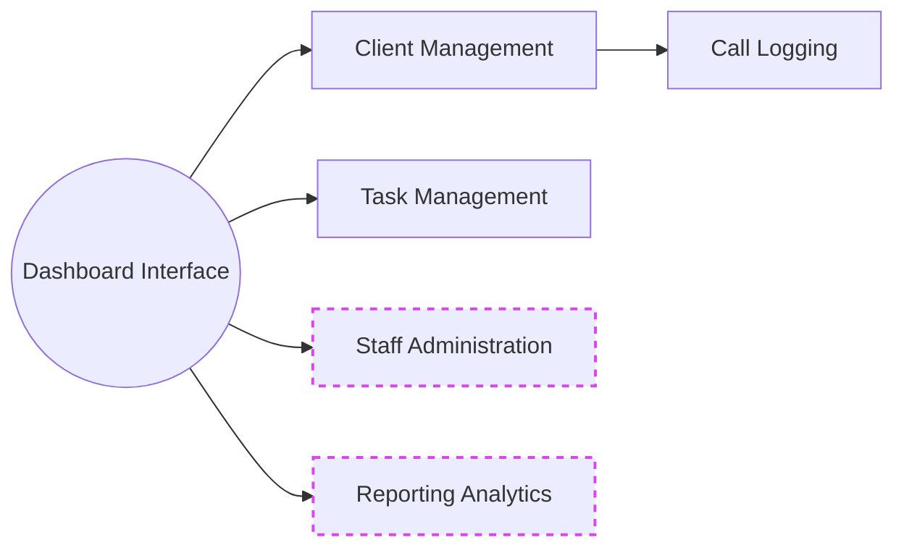
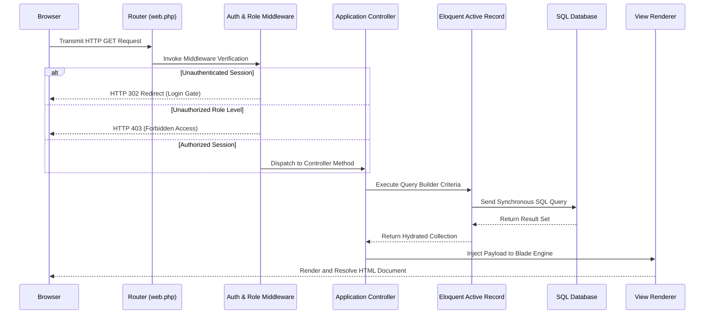
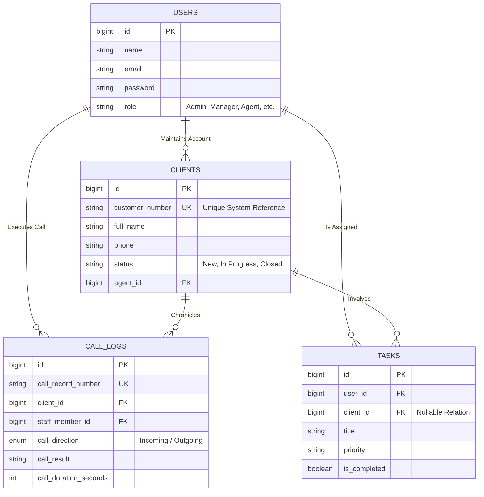
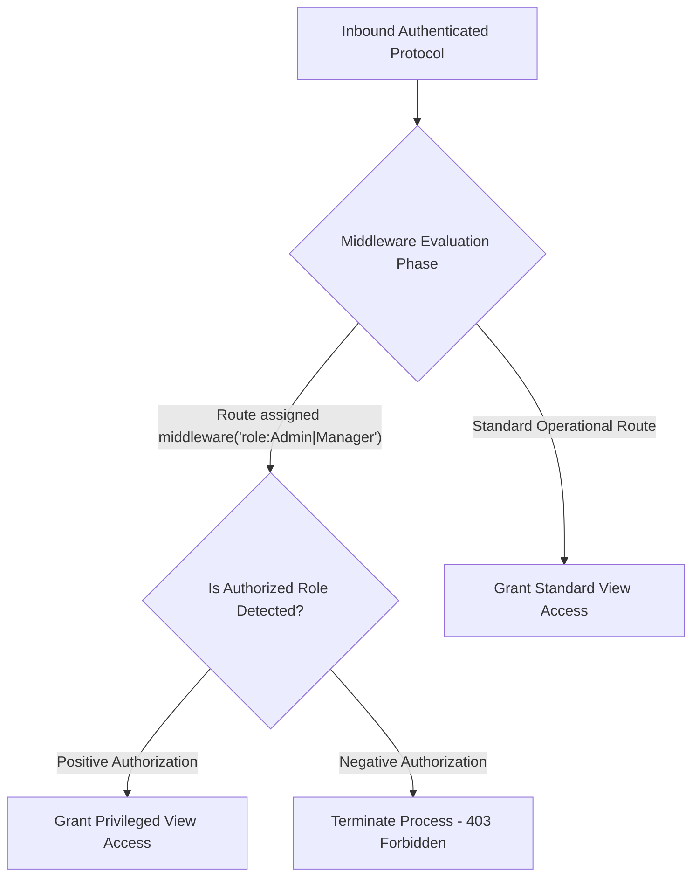

<div align="center">

# System Architecture & Technical Specifications Report
**CodecIT CRM (codecitsalesforce)**
<br>
*Document Classification: Internal / Technical Documentation*<br>
*Platform Version: Laravel 12.x*

</div>

---

## Table of Contents
**1.0 Executive Summary**
**2.0 Functional Requirements and Modules**
&nbsp;&nbsp;&nbsp;&nbsp;2.1 Authentication & Authorization
&nbsp;&nbsp;&nbsp;&nbsp;2.2 Staff Administration
&nbsp;&nbsp;&nbsp;&nbsp;2.3 Client Relationship Management
&nbsp;&nbsp;&nbsp;&nbsp;2.4 Call Logging and Communication Tracking
&nbsp;&nbsp;&nbsp;&nbsp;2.5 Task Management Operations
**3.0 System Architecture and Request Lifecycle**
&nbsp;&nbsp;&nbsp;&nbsp;3.1 MVC Implementation
&nbsp;&nbsp;&nbsp;&nbsp;3.2 Request Pipeline Diagram
**4.0 Technology Stack**
**5.0 Database Architecture (Entity-Relationship)**
**6.0 Security and Role-Based Access Control (RBAC)**
**7.0 User Interface and Functional Flow**
**8.0 Deployment and Environment Configuration**
**9.0 Directory Structure and Code Organization**

---

## 1.0 Executive Summary

The **CodecIT CRM** software system is a comprehensive Customer Relationship Management solution engineered atop the Laravel 12 framework. The primary objective of this system is to facilitate structured interactions between sales personnel, call center agents, and prospective or active client accounts. 

By centralizing data management, the platform mitigates data fragmentation, standardizes call logging methodologies specific to various telephonic dialer platforms, and enforces rigid hierarchical data access constraints. The expected outcomes of its deployment encompass increased operational efficiency, enhanced administrative oversight regarding staff productivity, and formalized client engagement tracking.

---

## 2.0 Functional Requirements and Modules

The system is compartmentalized into several core modules, with accessibility strictly governed by hierarchical privilege levels.


*Note: Modals featuring dotted borders designate features restricted to authorized Management or Administrative personnel.*

### 2.1 Authentication & Authorization
This module functions as the foundational security layer, protecting all sensitive operational data. It manages the creation of secure sessions, user authentication, and profile administration. Only authenticated identities may proceed into the internal application zones.

### 2.2 Staff Administration
This administrative component is utilized to onboard, modify, and terminate system access for employees. 
- **Designated Roles:** `Administrator`, `Manager`, `Team Lead`, `Agent`, `Beader`.
- **Constraint Policies:** Standard operational roles (e.g., Agents) are restricted to pertinent operational data. Management and Administration roles retain global visibility and oversight capabilities.

### 2.3 Client Relationship Management
The core repository detailing all customer entities.
- **Workflow:** Initial data entry designates an account as `New`. Subsequent interactions progress the lifecycle state to `In Progress`, `Closed - Won`, `Closed - Lost`, or `On Hold`.
- **Capabilities:** Features synchronous record modification, real-time AJAX-powered query mechanisms, and agent-specific assignments for portfolio ownership.

### 2.4 Call Logging and Communication Tracking
A high-fidelity interaction ledger inextricably linked to individual client profiles.
- **Data Captured:** External platform origin (e.g., Vicidial, Five9, RingCentral), call direction (Incoming vs. Outgoing), exact duration chronometrics, and defined call outcomes. 
- **Auditing:** In circumstances necessitating administrative override of logged data, the system strictly mandates an appended `admin_edit_reason` to preserve historical integrity.

### 2.5 Task Management Operations
An internal task delegation and workflow orchestration utility. Operational tasks encompass varying priority thresholds (`Low`, `Medium`, `High`) and may be bound to specific client initiatives or retained as generalized administrative duties.

---

## 3.0 System Architecture and Request Lifecycle

The CodecIT application strictly adheres to the Model-View-Controller (MVC) architectural pattern, capitalizing on the native capabilities presented by the Laravel Service Container.

### 3.1 MVC Implementation
1. **Routing (`routes/web.php`):** The primary ingress mechanism, routing categorized HTTP requests to the designated controller endpoints.
2. **Controllers (`app/Http/Controllers`):** The operational orchestrators. These classes (e.g., `ClientController`, `CallLogController`) enforce business logic constraints, solicit data models, and deploy the resulting structures to designated view layers.
3. **Models (`app/Models`):** The system's Object-Relational Mapping (ORM) layer utilizing Eloquent. These files encapsulate database relationship logics and mutate raw data. 
4. **Views (`resources/views`):** The presentation topology, rendering structured HTML via Blade template engine directives layered with compiled CSS logic.

### 3.2 Request Pipeline Diagram
The following sequence diagram details the synchronous execution of a standard authenticated data request.



---

## 4.0 Technology Stack

The engineering stack reflects a modernization initiative prioritizing rapid delivery and stringent typing constraints.

| Technology Layer | Component Selection | Architectural Function |
| :--- | :--- | :--- |
| **Backend Framework** | Laravel 12.x | Manages server-side routing, ORM transaction management, and core software logic. |
| **Execution Engine** | PHP 8.2+ | Provides statically-typed and highly optimized backend execution. |
| **Relational Database** | SQL Datastore | Manages persisted structured data mappings (MySQL/SQLite/PostgreSQL compatible). |
| **Frontend Layout** | Tailwind CSS 3.1 | A utility-first CSS integration deployed alongside `@tailwindcss/forms` for normalized inputs. |
| **Frontend Reactivity** | Alpine.js | A lightweight DOM-manipulation framework governing immediate UI interactivity without excessive payload overhead. |
| **Asset Compilation** | Vite v7.x | Manages optimized asset building and Hot Module Replacement (HMR) during localized development. |

---

## 5.0 Database Architecture (Entity-Relationship)

The system relies upon highly formalized relational mapping to ensure referential integrity between employee entities, CRM accounts, and communication metadata.



---

## 6.0 Security and Role-Based Access Control (RBAC)

### 6.1 Authentication Standards
Data perimeter security is upheld by Laravel's embedded session lifecycle, utilizing encrypted cookie mechanisms. Unauthorized requests bypassing active authentication are securely deflected from operational routes.

### 6.2 Role Authorization Enforcement
Rather than implementing heavy, external permissioning packages, the system leverages a high-performance attribute-based authorization strategy:
- Roles are explicitly constrained to a solitary schema column within the `users` data structure.
- The `RoleMiddleware` class executes interceptor procedures on critical route groupings.



> [!WARNING]
> **Privileged Data Caution:** Modification of underlying user roles or the purging of historical interaction logs (`call_logs`) is systematically reserved exclusively for personnel demonstrating an `Admin` or `Manager` authorization state.

---

## 7.0 User Interface and Functional Flow

The visual layout prioritizes cognitive ease for high-volume call environments.

1. **Analytical Dashboard:** Implements dynamic telemetry metrics. Top-level management visualizes aggregated corporate performance, whereas tiered agents encounter personalized performance quotas.
2. **Client Directory Matrices:** Actionable tabular interfaces coupling database semantic states with synchronized visual identifiers (e.g., standardizing `Closed - Won` statuses structurally alongside `bg-emerald-100` visual indicators).
3. **Communication Nested Logging:** Nested hierarchical lists delivering instantaneous chronological insights on a per-account basis. Features unobtrusive localized modals for synchronous data ingestion.
4. **Responsive Accessibility:** The interface is built upon flexbox/grid principles utilizing Tailwind methodologies, ensuring cross-platform stability (workstation and tablet form-factors).

---

## 8.0 Deployment and Environment Configuration

**System Prerequisites:** PHP >= 8.2, globally scoped Composer executable, Node.js environment, and a relational SQL socket.

1. **Acquire Source Code Data:**
   ```bash
   git clone <repository_url> codecitsalesforce
   cd codecitsalesforce
   ```

2. **Initialize Backend Package Matrix:**
   ```bash
   composer install
   ```

3. **Configure Environment Protocol:**
   Create an active `.env` instance referencing local or cloud database credentials.
   ```bash
   cp .env.example .env
   ```

4. **Cryptographic Key Provisioning:**
   Generate the requisite application cipher key to secure session payloads.
   ```bash
   php artisan key:generate
   ```

5. **Initialize Frontend Modules:**
   ```bash
   npm install
   ```

6. **Execute Relational Schema Deployment:**
   Propagate structural tables to the targeted SQL database.
   ```bash
   php artisan migrate
   ```

7. **Initiate Core Services:**
   Leverage the unified Vite compiling and artisan proxy script for simultaneous multi-service bootstrapping.
   ```bash
   composer run dev
   ```

---

## 9.0 Directory Structure and Code Organization

A fundamental diagnostic layout for engineering teams:

- 📂 **app/** *(Business Logic Core)*
  - 📂 **Http/Controllers/** - Translates network requests to software action (`ClientController.php`).
  - 📂 **Http/Middleware/** - Execution gates filtering unauthorized networks (`RoleMiddleware.php`).
  - 📂 **Models/** - Eloquent mapping logic.
- 📂 **database/migrations/** - Iterative class scripts managing sequential state changes to the SQL data structures.
- 📂 **resources/** *(Frontend Construction)*
  - 📂 **views/** - Encapsulated Blade engine files compartmentalized by features (`clients/`, `tasks/`).
- 📂 **routes/** *(Network Registry)*
  - 📄 **web.php** - Primary registry delineating HTTP verbs and route URI addresses.
- 📂 **public/** - The exposed index interface and pre-compiled static artifact repository.
