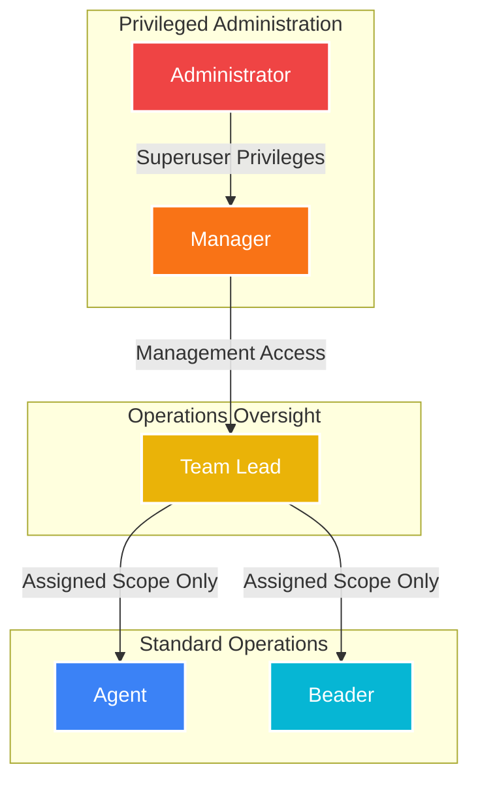

# CodecIT CRM — Role-Based Access Control (RBAC) Documentation

This document provides a comprehensive guide to the Security & Access Management Architecture of the **CodecIT CRM** platform. It details what each of the five user roles can and cannot do, followed by a summary matrix and implementation details.

---

## 1.0 Hierarchy of Roles

The platform enforces a five-tiered hierarchical role model. Below is the visualization of privilege scopes:



* **Privileged Administration (Admin & Manager):** Global system controllers.
* **Operations Oversight (Team Lead):** Supervisory view over client operations.
* **Standard Operations (Agent & Beader):** Restricted strictly to self-assigned data.

---

## 2.0 Dynamic RBAC Feature Matrix

The following matrix describes who can perform which operations on the system features:

| System Feature / Operation | Administrator | Manager | Team Lead | Agent | Beader |
| :--- | :---: | :---: | :---: | :---: | :---: |
| **System Settings** | **Full CRUD** | **Full CRUD** | ❌ Denied | ❌ Denied | ❌ Denied |
| **User Administration (`/users`)** | **Full CRUD** | **Full CRUD** | ❌ Denied | ❌ Denied | ❌ Denied |
| **Project Management (`/projects`)** | **Full CRUD** | **Full CRUD** | ❌ Denied | ❌ Denied | ❌ Denied |
| **Financial Ledger / Payments** | **Full CRUD** | **Full CRUD** | ❌ Denied | ❌ Denied | ❌ Denied |
| **Tax Invoice Generation** | **Full CRUD** | **Full CRUD** | ❌ Denied | ❌ Denied | ❌ Denied |
| **Global Client Directory** | **View All** | **View All** | **View All** | ❌ Denied | ❌ Denied |
| **Client Actions (Add/Edit)** | **Any Client** | **Any Client** | **Any Client** | **Own Clients Only** | **Own Clients Only** |
| **Client Deletion** | **Yes** | **Yes** | **Yes** | **Own Clients Only** | **Own Clients Only** |
| **Global Tasks Directory** | **View All** | **View All** | **View All** | ❌ Denied | ❌ Denied |
| **Task Actions (Add/Edit/Complete)** | **Any Task** | **Any Task** | **Any Task** | **Own Tasks Only** | **Own Tasks Only** |
| **Log Call Record** | **Yes** | **Yes** | **Yes** | **Yes** | **Yes** |
| **Edit/Modify Call Record** | **Yes (Reason Req)** | **Yes (Reason Req)** | **Yes (Reason Req)** | ❌ Denied | ❌ Denied |
| **Delete Call Record** | **Yes** | ❌ Denied | ❌ Denied | ❌ Denied | ❌ Denied |
| **Self Profile Edit** | **Yes** | **Yes** | **Yes** | **Yes** | **Yes** |

---

## 3.0 Comprehensive Role Profiles

### 3.1 Administrator (Admin)
The Superuser of CodecIT CRM. 
* **Capabilities:** 
  * Full control over global system settings.
  * Create, update, list, and delete user profiles of any role.
  * Manage projects, record payments, and download ledgers or invoices.
  * Access the global client list and modify/delete any client.
  * Create, assign, or delete any task in the system.
  * **Exclusive Privilege:** Only the Admin can delete communication Call Logs from the database.
* **Constraints:** None. (Cannot delete their own active user session account).

### 3.2 Manager
The operational controller.
* **Capabilities:**
  * Full access to Project Management, Settings, Ledger, Payments, and Invoice generation.
  * Full access to User Management (Onboard staff, edit settings).
  * Global visibility to see all clients and tasks.
  * Edit call logs (requires appending a 10+ character `admin_edit_reason`).
* **Constraints:**
  * ❌ **Cannot Delete Call Logs:** Purging historical logs is permanently locked for managers to preserve compliance.

### 3.3 Team Lead
The operational supervisor.
* **Capabilities:**
  * View, search, and list **all** clients in the system.
  * Edit call logs (requires appending a 10+ character `admin_edit_reason`).
  * Assign new/edited clients to **any** agent.
  * View and manage tasks for all agents.
* **Constraints:**
  * ❌ **No Project Access:** Denied access to `/projects` routes.
  * ❌ **No User Management:** Denied access to `/users` routes.
  * ❌ **No Deletion:** Cannot delete call records.

### 3.4 Agent
Standard field operator.
* **Capabilities:**
  * Create new clients (automatically assigned to themselves).
  * View, search, edit, or delete clients assigned to them.
  * Create tasks linked to their clients.
  * Log call interactions for their clients.
* **Constraints:**
  * ❌ **Scope Lockdown:** Cannot view, edit, or search clients/tasks assigned to other agents (aborts with `403 Forbidden`).
  * ❌ **No Call Modifying:** Once a call log is saved, they cannot edit it.
  * ❌ **No Project/User/Settings Access:** Complete route restriction.

### 3.5 Beader
Operates identically to standard Agents within CodecIT CRM permission schemas.
* **Capabilities:** Same as Agent.
* **Constraints:** Same as Agent.

---

## 4.0 Technical Enforcement & Security Architecture

Role boundaries are enforced on the backend at three critical layers to prevent URL manipulation attacks:

### 4.1 Route Level Middleware (`RoleMiddleware`)
Protects administrative URL endpoints in `routes/web.php` by intercepting network requests:
```php
Route::middleware('role:Admin|Manager')->group(function () {
    Route::resource('projects', ProjectController::class);
    Route::resource('users', UserController::class);
});
```
*If a Team Lead, Agent, or Beader manually navigates to `/projects` or `/users`, `RoleMiddleware` throws an instant **`HTTP 403 Forbidden`**.*

### 4.2 Controller-Level Context Controls
Controllers check the requesting user's role to scope queries or abort actions:
* **Client & Task Scopes:**
  ```php
  // ClientController.php
  $isManagement = $user->isManagement(); // True for Admin, Manager, Team Lead
  
  $clients = Client::when(!$isManagement, function ($query) use ($user) {
      return $query->where('agent_id', $user->id); // Locked down to own ID for Agents/Beaders
  })->get();
  ```
* **Explicit Action Aborts:**
  ```php
  // CallLogController.php
  if ($user->isAgent()) {
      abort(403, 'Agents cannot edit call records. Please contact your manager.');
  }
  ```

### 4.3 Database Integrity Constraints
* Call log overrides strictly mandate an `admin_edit_reason` column payload, audited inside `codec_call_logs`.
* Users cannot perform destructive operations on critical historical tables (`codec_projects`, `codec_payments`, `codec_call_logs`) without role verification.
